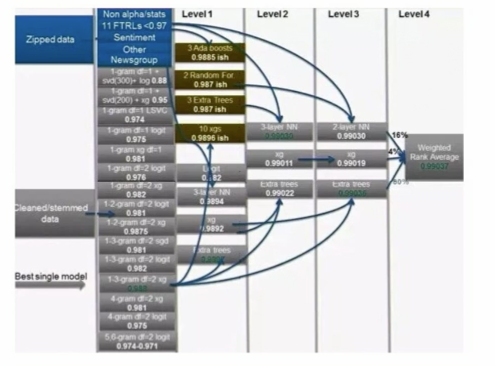

# Ensembles and Metamodeling

## Key Concepts

* ### What is an Ensemble

  * The sample at hand is a model being built to predict the gallons per mile for vehicles.
  * We've built an ensemble of 3 models:
    * Linear Regression
    * Neural Network
    * C&RT (Regression Tree)
  * We take an average of the 3 models to predict the final score of the model.
  * Ideally, the final score of the combination should be better than any of the models separately.
  * On looking at the first row, we find that the **Regression** model had the best score in this case.
  * We want all 3 of them models to share the load or pull their weight, if any of the models has very low percentage of having the winning score, it may not belong in the ensemble.
  * On taking percentages of best predictions, we see that all 3 models have close to 30% winning scores.
  * If there are cases where 1 model is working the most and the other 2 are just backup, we should look into the ensemble and rethink our choices.
  * 
  * 
  * Ideally, We want our ensembles to compliment each other when it comes to errors, so that even if one of them models fails for a case, the other 2 will have predicted the correct value.

* ### Types of Ensembles

  * **Heterogeneous Ensembles**
    * Different component models
    * Components Built largely independently
  * **Homogenous Ensembles**
    * Some examples are: random forests, xgBoost, adaboost
    * Slightly different variants using the same algorithm
    * Sometimes built iteratively
  * Metamodeling
    * Models working together to solve a problem.
    * Models could be sending info to other models, not as simple as an average.
    * Different models could be for different cases.

## Understanding Model Error

* ### Measuring model Accuracy: Value Estimation

  * We'll use **Mean Absolute Error** to see the performance of the models individually and of the ensemble.
  * We see although the MAE of the ensemble is close to some of the other models, it's still doing a little better than its components.

* ### Measuring model Accuracy: Classification

  * We've taken the usecase of the Titanic dataset and predicted using CHAID, C&RT and C5.0.
  * The ensemble seems to be working similar to the other 3 models when we look at the overall performance.
  * On looking at the confusion matrix, we find out that the drop in accuracy seems to be because all 3 models seem to be failing in almost same cases, which is why the ensemble is not improving the overall by much.
  * Essentially, it's better to look at both **Overall Accuracy and the Confusion Matrix** in case of a classification ensemble.

## Simple Heterogeneous Ensembles

* ### Stacking

  * Stacking has been doing very well in the competitions on Kaggle.
  * We'll use the 3 miles per gallon models and feed the results into a 4th model which will decide on how to use the scores of the 3 models.
  * Essentially, it'll use a weighted average instead of a normal average.
  * The models seems to have come to the conclusion that if the MPG is less than 25.115 it'll use the CART model's prediction, if it's greater than that, it'll use the Neural Net's prediction.
  * 
  * On looking at the comparison of the performance of the individual models and the ensemble, we find that the ensemble is doing a little better, but not by much.
  * Conceptually, it is a good example of stacking, but in a real world problem, it might be better to just go with a single model.

* ### Voting for Classification

  * Not all of the models that we build for a dataset always agree on the predictions.
  * There are 3 primary ways to tackle this situation:
    * **Simple** voting: we select the prediction that 2 of the 3 models are making. 67% confidence means that 2 of the 3 models agree on the prediction.
    * **Highest Confidence**: we just use the prediction of the model with the highest confidence. Here we just copy the confidence of the models whose prediction we used.
    * **Weighted Voting**: this can further be of 2 types, column-wise or row/case-wise. In this case we calculate the confidence using the magnitude of the confidence of the different models being used.

## Bias-Variance Tradeoff

* ### Error Decomposition

  * **Model Error = Variance + Bias + Noise**
  * Our motivation for using ensembles is generally to reduce bias or variance, and if we're lucky, both!
  * **Variance** refers to the amount by which our model would change if we estimated it using a different training data set.
  * **Bias** refers to the error that is introduced by approximating a real-life problem, which may be extremely complicated, using a much simpler model.
  * Noise is sometimes called **Irreducible Error**, and this may not be something we can do anything about.
  * Another way to put these 2 is: Bias is a learner's tendency to consistently learn the same wrong thing. Variance is the tendency to learn random things irrespective of the real signal.

* ### Visualizing bias and error

  * We first use Linear regression to predict the MPG against weight and it clearly has some bias.
  * Next, we use a cubic line for the prediction, it's clear that the line explains the training data much better, but it is fairly possible that it might actually do worse for test data i.e. reduce bias but increase variance.
  * To explain it in another way, we fit linear regression lines for 4 different partitions of our training data. We can see that all 4 of the models have low variance but have quite a few outliers and thus biased.
  * Now we try cubic curves for the same 4 partitions. We can now see that the curves are quite different for all partitions. So if we take the model from one of the partitions and apply it to another partitions, it will have a lot of variance.
  * We call this a trade-off, because we can reduce the bias but the variance increases and vice versa.
  * For ex. we can have a curve going through all datapoints but variance will be very high, on the flip side, we can have very low variance with a simple constant Y axis line, but the bias will be very high.

* ### Curse of dimensionality

  * More is not always better i.e. using a lot of variables in a broken model may not always be a great idea.
  * In essence, if we introduce too many mediocre variables, we'll reduce the bias a little but amplify the variance.

* ## Occam's Razor

  * **Simple is better.**
  * **First razor:** Given 2 models with the same generalization error, the simpler one should be preferred because simplicity is desirable in itself.
    * Frequently our model must be transparent.
    * If our model is complex and opaque, all of the preparatory steps become even more important, since it won't be easy to figure out the mistakes in the modeling phase.
  * **Second razor:** Given 2 models with the same training-set error, the simpler one should be preferred because it is likely to have lower generalization error.
  * However, empirically, it is not always true that the simpler models is better. Although some ensembles concentrate on lower bias and others on lower variance, it is possible to combat both together.

## Ensemble Algorithms Fundamentals

* ### Bootstrap Aggregating (Bagging)

  * Bagging is done by having multiple versions of a model and you just average out the results in case of scale or plurality in case of classification.
  * The model versions (child trees) are run on Bootstrapped replicates of the training dataset.
    * We basically choose some cases at random, and every time a case is picked, it's put back in. This means that it's possible that some of the cases will get picked multiple times and some others won't get picked at all.
  * The point is, if we build a 100 trees on the same dataset, the resultant trees will all be the same, with bootstrapped replicates, we get some much needed variations in the datasets used in the various model runs.
  * Bagging concentrates on reducing variance by averaging out the results of its various child trees.

* ### Boosting

  * Boosting increases the weights for the predictions that were wrong.
  * Ada-boosting uses some complicated mathematics for calculating weights for the incorrect predictions. For simplicity, we'll just double the weights of the incorrect predictions.
  * We can see the reduction in the number of failed predictions now.

* ### Gradient Boosting

  * In gradient boosting, we try and reduce the cost function to minimum.
  * Cost basically means the sum of the differences between the observed and expected values for the incorrect predictions.

## Important Ensemble Algorithms

* ### Random Forest

  * Bagged trees tend to be similar, even though we randomize the dataset.
  * In case of random forests, a random selection of features is done.
  * You want the component trees to be flexible, but aggregating makes the model more generalizable.
  * No pruning in Random Forests.
  * It's an old technique, but still a very famous one.

* ### Model search by Bumping

  * The point of this algorithm is that in Bagging once you start aggregating, the resultant model is not a tree anymore, so it uses the random samples to build multiple trees and then simply selects the best tree.
  * Not a very famous tree, but still a good one to know.

* ### AdaBoost, XGBoost, Light GBM. CatBoost

  * AdaBoost: we find the incorrect rows and give them added weight.
  * XGBoost: we define a loss function (eg. residual) and try to minimize it.
  * Light GBM: is made to be scalable for larger datasets.
  * CatBoost: tries to combat the issue of overfitting.

* ### Super Learner, Subsemble, StackNet

  * **Super Learner**
    * In stacking we come up with a few models (3 in our example) and then feed the results of these models into a meta-learner which weighs these predictions and comes up with a meta-prediction.
    * In case of stacking the basics differ in comparison to the other algorithms.
    * Partitioning is different and cross-fold validation is generally used instead of training-test validation.
    * We need access to a lot of algorithms for the component models, so that we can get strength from diversity.
    * We have to make a good choice for the meta-learner, we chose CART because it's easy to understand. **General Linear Model, Generalized Linear Model and Deep Learning** are some of the examples of meta learners.
    * We also have to take into account the kind of data that's being fed to us or the kind of results that are being produced by the level models before we choose the meta-learner.
  * **Subsemble**
    * It does the cross validation in a different way and that makes it much more stable.
  * **StackNet (Deep stacking)**
    * 
    * You have multiple layers of stacking between the inp[ut variables and the final prediction.
    * Although it is similar to deep learning in some way, there is also a key difference. The weights are adjusted using backward propagation in case of deep learning whereas in deep stacking, the weights are adjusted in the forward direction.

* ### Other things that are being worked on right now:

  * Ensembles have gotten as complex as they can and they are very good at accuracy.
  * In some business cases accuracy is as important as transparency.
  * Two common strategies in use to achieve the new trend are:
    * The first is, after the ensemble is built and demonstrated to be accurate, its then reduced to a simpler, more interpretable model on the backend.
    * The other approach is to put constraints on the solution, a complex model is built, but in a way which is easier to interpret.

## Ensembles and Meta-Modeling Case Studies

* ### Combining supervised and unsupervised learning

  * We have the usecase of 10% kdd cup dataset here. We have to predict if the connection is normal or attack and if it is an attack, then of which type.
  * The best way is to use multiple approaches and combine them. Not just averages or blend but use them in different ways.
  * We use 1 model to classify them to decide if the connection detail is normal or not. We use C5.0 and then generate propensity scores for all connections, which are between 0 and 1, 0 means high propensity of not being an attack and 1 being high propensity of being an attack.
  * The second model is used to predict the type of attack. Since there are multiple possibilities here, the probability of the model being right might be a little lower, but it will still be helpful so that the IT team can know where to look.
  * The third model is a Kohenen map which is an unsupervised approach. We're trying to use it to divide attacks into common patterns and rare patterns. The rare patterns might be a new type of attack. After building the map, we try and calculate if the coordinates are rare or not. If the number of nodes on a coordinate is < 100, it's rare.
  * We then put the results of the 3 models into a table and then use look into the 3 results in different ways. For ex. if a connection has a high propensity score, meaning that it's a normal connection but K-map says it's a rare cluster, we look into it anyway, since this could be a new type of attack.

* ### Routing cases to different models

  * We'll use kdd_98 data usecase for this one. The dataset has a lot of missing data, infact 0% of the rows in the dataset are complete.
  * An observed pattern was, the missing data pattern for new users (RFA_3_FirstLetter = 'N') vs for older users.
  * On analyzing the 2 groups further, we see that the favoured variables for the new users and for the old users are quite different, which further strengthens our belief that this might be a usecase where we can use 2 different models for the 2 groups.
  * We end up building 2 different random forests for the 2 groups with different datasets and different variables.
  * But finally we do combine them and the combination results in simple and similar propensity scores, although the scores come from 2 different models in different cases, the final model is very easy to use and deploy.