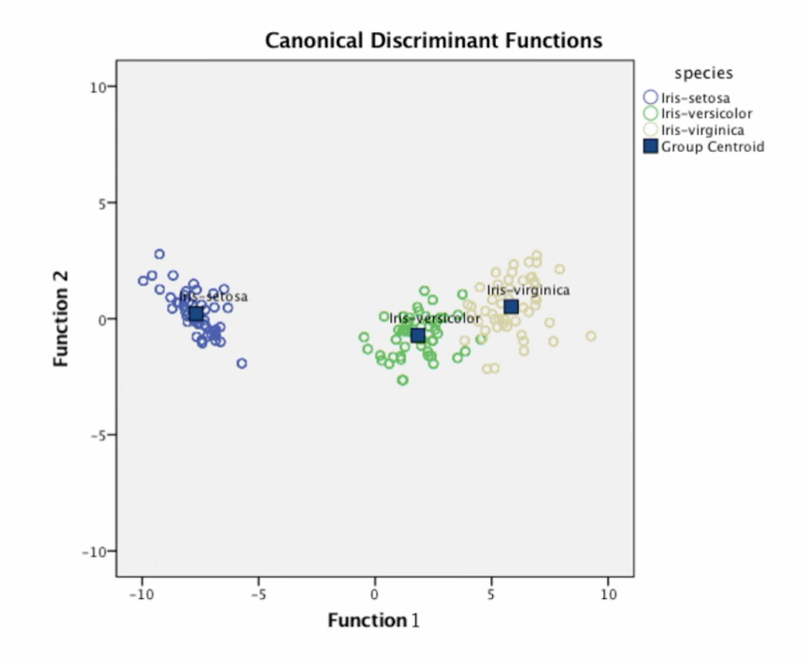
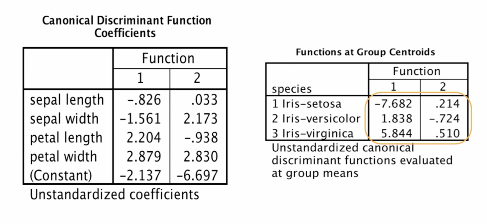
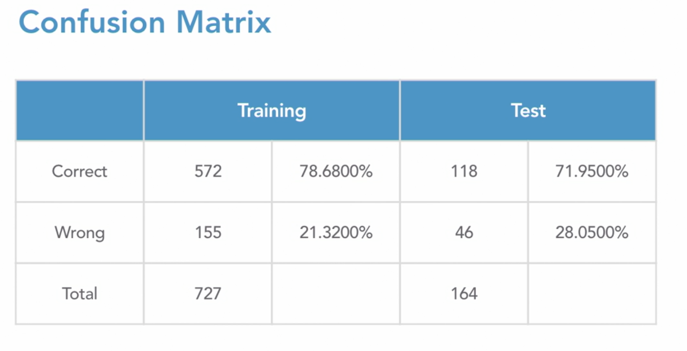
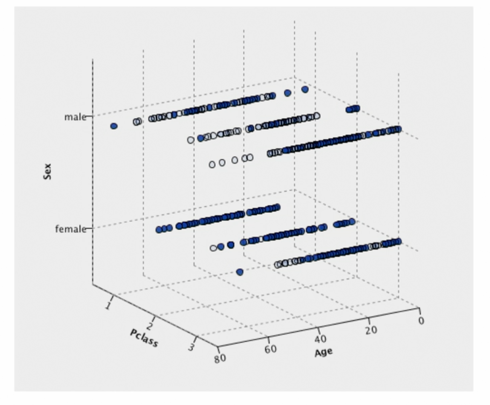
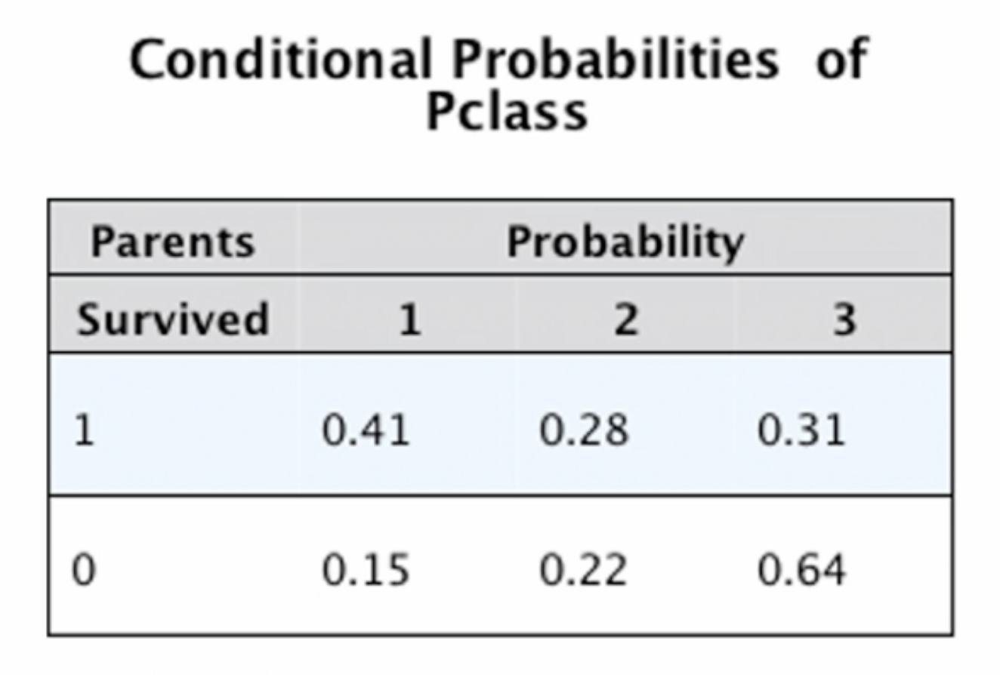

# Classification modelling

## **Defining the Classification Strategy**

* ### Importance of Binary Classification

  * There are two famous myths regarding classification:
  * Each usecase = One best Algorithm, and if we define the problem properly, we'll kno which one to use. In general, this is a one-to-many relation between the problems and the solutions.
  * The goal of projects is one model. In real world usecases, we generally have multiple models sending info back and forth to make the final decision.
  * Binary classifiers play a role in all predictive analytics projects.

* ### Binary vs Multinomial: :dancers

  * The best part about binary classification is: there's a 50% chance of being correct to start with.
  * As we move into 3/4/5 categories the chances become 33%/25%/20%, even if we double the chances, 40% is still pretty bad.
  * Some valid usecases are: cluster-analysis
  * The model also gets very complicated if there are more than 2 categories.
  * If you do have a business usecase for more than 2 categories, try to still go down to 2.
  * Targets with more than 2 categories should be kept rare.

* ### Black-Box techniques

  * Neural networks
  * An ensemble of models: Random forest
  * To explain or to predict?
  * If the explanation is required, skip the black box techniques.
  * The older techniques persist because they are the best option.

* ### One task, many algorithms

  * Trial and error is the only way to find the best algorithm for a problem at hand.

* ### Statistics vs machine learning

  * Statistical algorithms are old and complex to understand, but they're still used:
    * Experts still use them
    * They are transparent in general
    * They are scalable
    * You can include both in an ensemble

* ### Model assessment vs business evaluation

  * Model assessment is ranking models on technical criterion.
  * Business evaluation looks at models performance based on ROI, performance indicators and management criteria.

----

## **Choosing a Winner**

* ### Training and test partitions

  * To start with, you break down the historical data into 2 partitions:
    * 50% for training
    * 50% for testing
  * As the dataset size gets smaller, the percentage for training data increases and test data decreases
  * There's an argument for a third partition, 50% training (candidate models), 25% test (candidate models), 25% validate (final model)
  * Another way to go about it is: use historical data only for training and test -> evaluate models using various technical approaches, and when the model is ready, run it on the data that has accumulated while you were building the model.
  * Some ways to evaluate models:
    * Lift Charts
    * Gains tables
    * Confusion matrix

----

## **Algorithms**

* ### Common issues

  * Interactions between variables: do the variables contribute to the model individually or they interact with each other?
  * Missing data handling
  * Over-fitting/under-fitting: not complex enough will lead to lower accuracy, too complex and it won't fix the new data well.
  * Feature selection: how does it determining which variables to use and how important those variables will be.

* ### Things to attend to

  * Does it use all or some of the variables?
  * Does it use all or some of the test data?
  * Situations where the model will perform well or bad.

* ### Discriminants (Linear Discriminant Analysis) with three categories

  * We're analyzing the classic petal width vs petal length usecase.
  * We plot the training data on a 2D graph and draw a regression line.
  * 
  * 
  * 
  * 

* ### Discriminants with two categories

  * Typically operates on list-wise deletion of missing data.
  * Some implementations will impute
  * Typically all inputs are used
  * Stepwise variable selection
  * Scale variables only
  * This is an example of the Titanic dat-set.
    * The variables taken are:
      * Age
      * Passenger Class=1/2
      * Embarked=C/Q
      * Sex=Female/Male
      * Age is the only scale variable here.
      * We convert class to scale variables using: pClass1 = true/false, pClass2 = true/false etc.
    * 
    * The difference between the correctness of the model between training and test data is more than 5%, so the model's performance is not that great.
    * We can maybe try to include a few more variables and remove the weaker ones.
    * 
    * The decision here is rather simple, we calculate the score for survival and death by sum (coefficients * variable_value).
    * Whichever score is bigger, the selected person is predicted to be dead.

* ### Stepwise discriminants

  * We let the algorithm decide the variables for us so we take a wider range of variables in this case
    * Age
    * Passenger class
    * Embarked
    * Sex
    * Sibling-Spouse
    * Parent-Children
    * Fare
  * This one is considered controversial because sometimes the variables chosen on training data is not optimal on test data.
  * After the algorithm was run, it chose age, passenger class, sex and sibling-spouse.

* ### Logistic regression

  * List-wise deletion
  * All inputs are used or stepwise
  * Have to use scale variables or dummy coding
  * Arguably the most transparent - lots of details
  * Titanic usecase with the same variables
  * Y = B1*X1 + B2*X2 + .... + constant
  * Score = 1 / ( 1 + exp(-(Y)))
  * The detailed coefficients are what make statisticians prefer it.
  * 
  * 
  * You still want to improve the model and not dismiss it as is, maybe the less significant embarked was the issue or maybe some other variables need to be included.

* ### Stepwise logistic regression

  * We let the algorithm decide the variables for us so we take a wider range of variables in this case
    * Age
    * Passenger class
    * Embarked
    * Sex
    * Sibling-Spouse
    * Parent-Children
    * Fare
  * After the algorithm was run, it chose age, passenger class, sex and sibling-spouse.

* ### Decision trees

  * Many different types, a family of techniques.
  * Variety of missing data-handling options but no list-wise deletion.
  * Greedy: all inputs are not used.
  * All types of variables
  * Interactions are very easy to see
  * Titanic usecase: age, passenger class, embarked and sex.
  * 
  * Only if then else conditions, no complicated formulas here.

* ### KNN

  * k-Nearest Neighbors.
  * "Lazy" learner.
  * "Nearest" is Euclidean distance.
  * All inputs are used.
  * K = The number of neighbors to make a decision (k=8)
  * Titanic usecase: age, passenger class, embarked and sex.
  * 
  * Running the algorithm on the first guy from test data give the following neighbors
  * 
  * Since they all died, the test data also will be predicted to be dead.

* ### Linear SVM

  * One of the most popular algorithms of the last decade
  * Black box technique
  * All inputs are used and it is robust even for a large number of inputs
  * There is an important param: C that influences the bias-variance trade-off
  * 
  * 
  * 
  * 

* ### Neural nets

  * Deep learning is a special kind of neural network.
  * We will discuss multilayer perceptrons
  * Black box technique
  * All inputs are used - input screening is often helpful
  * Backward propagation
  * Titanic usecase: age, passenger class, embarked and sex.
  * 
  * 

* ### Bayesian networks

  * Bayes' theorem is about combining probabilities
  * Three ways of addressing interactions
  * Naive Bayes an Bayesian networks are not the same
  * Unique since an SME could design the network and then fit the data
  * Titanic usecase: age, passenger class, embarked and sex.
  * 
  * This is not scalable, since even with 4 variables we have a lot of possibilities.
  * Naive Bayes' doesn't test any interactions.
  * 
  * 
  * 
  * 

* ### Ensembles

  * All of these models iterate, culminating into a final model that benefits from the previous ones.
  * Heterogeneous Ensemble: different types of models combined, finally we take the average of the (propensity) scores of the models. Another way is to go with the most confident model.
  * Bagging aka Bootstrap Aggregating: building a model on different partitions of the data. Random forests is the most famous one: combination of 3 trees into a final model. In reality it'll be more like 100+ trees into a final model.
  * Boosting: the models are generally of the same kind. We make a chain and feed some information (typically it's the errors that the first one makes, so that we can reduce that in the second one) from the first model into the second one, onto the third and then into the final model.
  * Stacking: maybe different types of models, the results of the models is fed into a final model

----

## **Common Modeling Challenges**