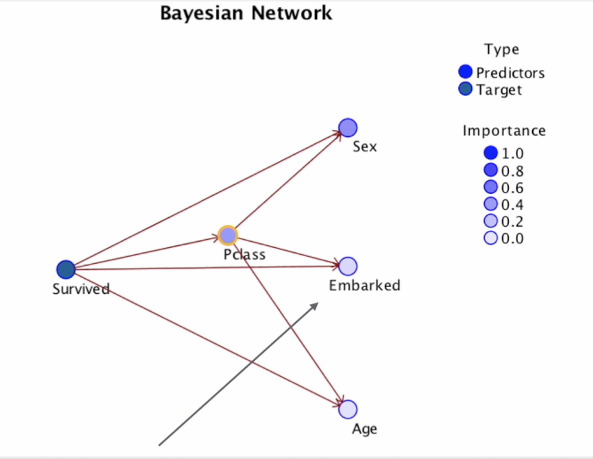

# Classification modelling

## **Defining the Classification Strategy**

* ### Importance of Binary Classification

  * There are two famous myths regarding classification:
  * Each usecase = One best Algorithm and if we define the problem properly, we'll know which one to use. In general, there is a one-to-many relation between problems and their solutions.
  * The goal of projects is one model. In real world usecases, we generally have multiple models sending info back and forth to make the final decision.
  * Binary classifiers play a role in all predictive analytics projects.

* ### Binary vs Multinomial

  * The best part about binary classification is: there's a 50% chance of being correct to start with.
  * As we move into 3/4/5 categories the chances become 33%/25%/20%, even if we double the chances, 40% is still pretty bad.
  * Some valid usecases are: cluster-analysis
  * The model also gets very complicated if there are more than 2 categories.
  * If you do have a business usecase for more than 2 categories, try to still go down to 2.
  * Targets with more than 2 categories should be kept rare.

* ### Black-Box techniques

  * Neural networks
  * An ensemble of models: Random forest
  * If an explanation for the model is required, skip the black box techniques.
  * The older techniques persist because they are the best option in some usecases.

* ### One task, many algorithms

  * Trial and error is the only way to find the best algorithm for a problem at hand.

* ### Statistics vs machine learning

  * Statistical algorithms are old and complex to understand, but they're still used:
    * Experts still use them
    * They are transparent in general
    * They are scalable
    * You can include both in an ensemble

* ### Model assessment vs business evaluation

  * Model assessment is ranking models on technical criterion.
  * Business evaluation looks at models performance based on ROI, performance indicators and management criteria.

----

## **Choosing a Winner**

* ### Training and test partitions

  * To start with, you break down the historical data into 2 partitions:
    * 50% for training
    * 50% for testing
  * As the dataset size gets smaller, the percentage for training data increases and test data decreases
  * There's an argument for a third partition, 50% training (candidate models), 25% test (candidate models), 25% validate (final model)
  * Another way to go about it is: use historical data only for training and test -> evaluate models using various technical approaches, and when the model is ready, run it on the data that has accumulated while you were building the model.
  * Some ways to evaluate models:
    * Lift Charts
    * Gains tables
    * Confusion matrix

----

## **Algorithms**

* ### Common issues

  * Interactions between variables: do the variables contribute to the model individually or they interact with each other?
  * Missing data handling
  * Over-fitting/under-fitting: not complex enough will lead to lower accuracy, too complex and it won't fix the new data well.
  * Feature selection: how does it determine which variables to use and how important those variables will be.

* ### Things to attend to

  * Does it use all or some of the variables?
  * Does it use all or some of the test data?
  * Situations where the model will perform well or badly.

* ### Discriminants (Linear Discriminant Analysis) with three categories

  * We're analyzing the classic petal width vs petal length usecase.
  * We plot the training data on a 2D graph and draw a regression line.
  * 
  * 
  * 
  * 

* ### Discriminants with two categories

  * Typically operates on list-wise deletion (delete the whole row if any value is missing) of missing data.
  * Some implementations will impute (predict the missing value by using its relation with other values)
  * Typically all inputs are used
  * Stepwise variable selection
  * Scale variables only
  * This is an example of the Titanic dat-set.
    * The variables taken are:
      * Age
      * Passenger Class=1/2
      * Embarked=C/Q
      * Sex=Female/Male
      * Age is the only scale variable here.
      * We convert class to scale variables using: pClass1 = true/false, pClass2 = true/false etc.
    * 
    * The difference between the correctness of the model between training and test data is more than 5%, so the model's performance is not that great.
    * We can maybe try to include a few more variables and remove the weaker ones.
    * 
    * The decision here is rather simple, we calculate the score for survival and death by sum (coefficients * variable_value).
    * the selected person is predicted to be dead/alive, based on whichever score is bigger

* ### Stepwise discriminants

  * We let the algorithm decide the variables for us so we take a wider range of variables in this case
    * Age
    * Passenger class
    * Embarked
    * Sex
    * Sibling-Spouse
    * Parent-Children
    * Fare
  * This one is considered controversial because sometimes the variables chosen on training data is not optimal on test data.
  * After the algorithm was run, it chose age, passenger class, sex and sibling-spouse.

* ### Logistic regression

  * List-wise deletion
  * All inputs are used or stepwise
  * Have to use scale variables or dummy coding
  * Arguably the most transparent - lots of details
  * Titanic usecase with the same variables
  * Y = B1*X1 + B2*X2 + .... + constant
  * Score = 1 / ( 1 + exp(-(Y)))
  * The detailed coefficients are what makes statisticians prefer it.
  * 
  * 
  * You still want to improve the model and not dismiss it as is, maybe the less significant embarked was the issue or maybe some other variables need to be included.

* ### Stepwise logistic regression

  * We let the algorithm decide the variables for us so we take a wider range of variables in this case
    * Age
    * Passenger class
    * Embarked
    * Sex
    * Sibling-Spouse
    * Parent-Children
    * Fare
  * After the algorithm was run, it chose age, passenger class, sex and sibling-spouse.

* ### Decision trees

  * Many different types, a family of techniques.
  * Variety of missing data-handling options but no list-wise deletion.
  * Greedy: all inputs are not used.
  * All types of variables
  * Interactions are very easy to see
  * Titanic usecase: age, passenger class, embarked and sex.
  * 
  * Only if then else conditions, no complicated formulas here.

* ### KNN

  * k-Nearest Neighbors.
  * "Lazy" learner.
  * "Nearest" is Euclidean distance.
  * All inputs are used.
  * K = The number of neighbors to make a decision (k=8)
  * Titanic usecase: age, passenger class, embarked and sex.
  * 
  * Running the algorithm on the first guy from test data give the following neighbors
  * 
  * Since they all died, the test data also will be predicted to be dead.

* ### Linear SVM

  * One of the most popular algorithms of the last decade
  * Black box technique
  * All inputs are used and it is robust even for a large number of inputs
  * There is an important param: C that influences the bias-variance trade-off`
  * 
  * 
  * 
  * 

* ### Neural nets

  * Deep learning is a special kind of neural network.
  * We will discuss multilayer perceptrons
  * Black box technique
  * All inputs are used - input screening (analyzing variables for importance) is often helpful
  * Backward propagation
  * Titanic usecase: age, passenger class, embarked and sex.
  * 
  * 

* ### Bayesian networks

  * Bayes theorem is about combining probabilities
  * Three ways of addressing interactions
  * Naive Bayes and Bayesian networks are not the same
  * Unique since an SME could design the network and then fit the data
  * Titanic usecase: age, passenger class, embarked and sex.
  * 
  * This is not scalable, since even with 4 variables we have a lot of possibilities.
  * Naive Bayes' doesn't test any interactions.
  * 
  * 
  * 

* ### Ensembles

  * All of these models iterate, culminating into a final model that benefits from the previous ones.
  * Heterogeneous Ensemble: different types of models combined, finally we take the average of the (propensity) scores of the models. Another way is to go with the most confident model.
  * Bagging aka Bootstrap Aggregating: building a model on different partitions of the data. Random forests is the most famous one: combination of 3 trees into a final model. In reality it'll be more like 100+ trees into a final model.
  * Boosting: the models are generally of the same kind. We make a chain and feed some information (typically it's the errors that the first one makes, so that we can reduce that in the second one) from the first model into the second one, onto the third and then into the final model.
  * Stacking: maybe different types of models, the results of the models is fed into a final model

----

## **Common Modeling Challenges**

* ### Imbalanced target categories

  * This is common and impacts almost all of the algorithms
  * In the titanic usecase, the split is 62% died vs 38% survived
  * We reduce the number of the dead by removing some at random to bring the data split to 50-50.
  * The bad split leads to having good rules for the higher percentage group but not for the others. This can happen quite often in **Payment Fraud** scenarios.
  * Balancing is done only on training data not on test data, with this we get a real world picture of the performance of our model.

* ### Interactions

  * When the relationship between two variables depends on a third.
  * The following linear regression plot on starting salaries vs education level clearly shows a striking difference between the trends for men and women, so the variable **gender** has to be included since the primary relationship is affected by it.
  * 
  * Diabetes risk: although weight is the most prominent variable, height can not be ignored, as evident from the following decision tree.
  * 
  * Combining variables can be a great way to reduce complexity, eg. like replacing height and weight with BMI. Especially in case of decision trees, we're making fewer segments, which allows us to have more data for other inputs.
  * 
  * If the model is not working as well as you want it to be, this might be one of the reasons.
  * Curvilinearity is a special kind of interaction
  * Some techniques will make you create new interaction terms.
  * Some others address interactions but in hidden ways: neural net
  * Trees are one of the easiest ways to find interactions.

* ### Missing data

  * Decision trees are the only exception to the rule
  * List-wise deletion is the most common approach
  * Be careful though, you'll want to check how many records were actually run by the other algorithms due to missing data. People don't always realize this, but if the dataset has a lot of missing data, the data left post list-wise deletion may not be enough.
  * Imputation
    * Can be as simple as replacing with the mean
    * Can be as complex as a neural network, if age is missing, you might use all of the other variables to predict the **age** value.
    * Too important to leave to chance, there's a big difference between 2% and 30%.
  * These are not the only solutions, in some cases, you might want to build a model for complete data and another one from incomplete data.

* ### Bias-variance trade-off and overfitting

  * High bias:
    * When a model is not **flexible** enough to get a sufficient signal i.e. not accurate enough. Eg. linear regression works only if there are linear relationships, if there's curvilinearity or variable interactions, it just won't work. In contrast, neural nets are inherently more flexible but they are a black box and complex.
    * Under fit.
  * High variance:
    * Model is too sensitive, it's picking up a lot of noise.
    * If that's happening in training data, it'll do a lot worse in test data.
    * It's generalizing poorly.
    * Over fit.
  * You'll want to find a balance between the two situations.
  * If you have high bias:
    * You might have to consider adding interactions.
    * Better address curvilinearity.
    * Or might just have to move to more complex algorithms which handle these issues better.
    * Might need to add more input variables.
    * Grow more aggressively.
  * If you have high variance
    * Too many weak and redundant inputs.
    * Try a simpler algorithm.
    * Grow less aggressively (try simpler).

* ### Data reduction AKA Feature selection

  * The removal of poor and redundant predictors before modeling.
  * Don't the algorithms already do this?
    * Trees and stepwise don't use all of the variables.
    * Techniques like neural nets can assign low weights.
    * Some implementations have extra features for this. E.g. there's a variation for KNN which performs feature selection.
  * Why is it even a concern?
    * No algorithm is immune to modeling noise. If a model performs worse in test data in comparison to training data, the 2 sets may have the same signal but different noise and the model will not work very well in production.
  * What can be done?
    * Try to run all of the **bi-variates**. i.e. look for input vs output individually.
    * Consider using one of the techniques as a screen before modeling. Eg. build a decision tree to screen and then build the neural net.
    * Try to identify redundancy like Factor analysis, Confusion matrix etc.
    * Like after adding BMI you don't need height and weight.
    * Some implementations have dedicated features. Try with the feature turned on and off.
    * Boosting can offer a powerful insight.
  * Modeling challenges are best address empirically, just try things many different ways!
