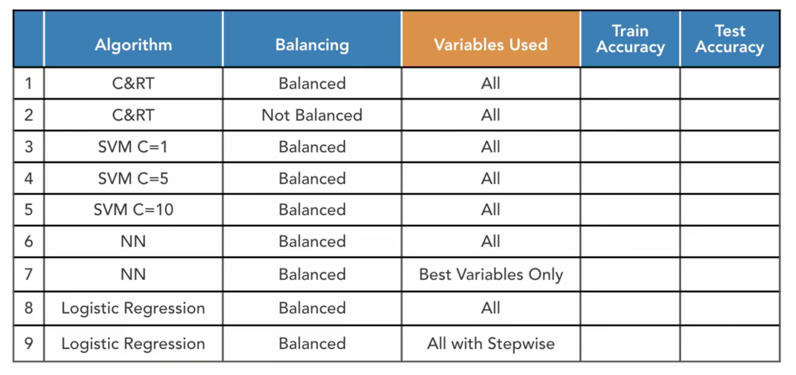
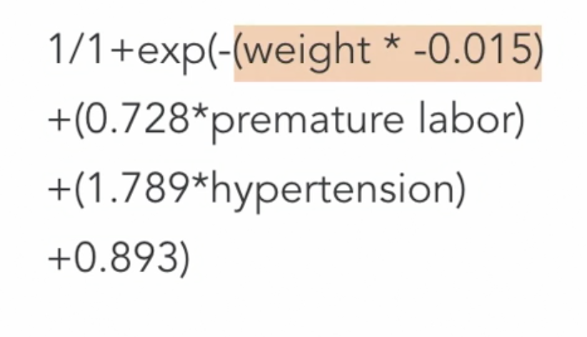
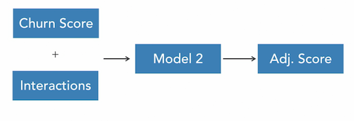

### **Data Bottlenecks**
  * Store: the myth of storing all = model all
  * Assess: how much do I have? How much do I need?
  * Select: rationale for inclusion and exclusion
  * Integrate: merge. append and aggregate
  * Explore: what patterns are there in the data? What data quality issues do I have?
  * Prepare: transforming the data into a form that the models need
  * Model: data < All, shouldn't worry about data size anymore, the data at hand is now clean, relevant and ready for use.
  * Score: should be focused on speed.
  * Maintain: rebuilding the model, try and automate all of the steps so that manual intervention is minimal after going LIVE.
----
### **Reducing Data Size**
  * Not all cases are relevant:eg. data with missing emails
  * Going too far back in history causes problems
  * Balancing and partitioning
### **Designing a data-set**
  * #### Minimum Data-size
    * > 1000+ churns
    * > 1000+ non-churns
    * > Test and training data
    * > Overall, it should be 4000 + for a model to be applicable and reliable.
    * > In general it'll be hard to find the 2000+ churns.
    * > Many data scientists also suggest to have a validation data-set which takes it to 3000+ churns.
     ##### What if there's not enough data?
      * > We can skip the validation data.
      * > We can have a smaller test-data set.
      * > What if you still don't have 1200+ churns?
  * #### Balancing
    * > If we have 20,000 frauds and 2,000,000 normal transactions
    * We must first bring down the number of normal transactions to 20,000 using randomization.
    * Next, it's better to have more data for training than test and validate
    * So we cut it down to 16,000 fraud and 16,000 normal transactions for Training
    * 2000 for test data and 2000 for validation data.
    * Overall we're left with 40,000 cases in comparison to the initial 2,020,000 cases.
  * #### Who truly has big data?
    * ##### LinkedIn
      * 500,000,000 subscribers worldwide.
      * 260,000,000 logins monthly
      * 9 billion content impressions weekly.
    * ##### Netflix
      * 120,000,000 subscribers worldwide
      * 8 million events per second.
    * ##### Regional healthcare provider
      * 30-day readmit use-case
      * Over 2 billion transactions in the DWH
      * < 250,000 admissions last year
    * ##### Cell phone carrier
      * Churn use-case
      * 60,000,000 customer IDs in the DWH
      * Billions of phone calls linked to those customers.
      * But if we talk about how many of these actually used the phone for at-least one call last year, the number will go down by a big margin.
    * **Once the healthcare and cell-phone usecase was drilled down to the real customers/transactions the project was much more manageable from storage PoV.**
  * #### Assess
    * Rows per case (max number of rows for a customer): try and remove data with a missing connection/info.
    * Summarizing the rows: may not need to store the value for all transactions, instead, the avg/sum can be stored. We may however want to save the number of card vs cash transactions.
    * Date range: to figure out the timelines of the data and to decide how far back we need to go to have enough data.
    * Inactive rows: if there are any customers which do not have any recent transactions.
  * #### Selecting: data that should be left out
    * We should only add past and new incoming data, which will be used by our model to calculate the score.
  * #### Seasonality and time alignment
    * In general, we end up looking at the data over a year, since that includes all applicable seasonal elements.
    * Going for a few months or 1 may ignore the seasonality element.
    * Going by the same logic, 10 years' data may be better than 1 years', but that's not the case in general due to the changing technologies, shopping patterns etc.
    * Let's say a customer was with us since December 2018, we have his non-free-pack spends for every month and he ended up getting churned in December 2019.
    * We use the **baseline** as December 2018 - August 2019 and the recent months as September 2019 - November 2019.
    * Now this is just 1 customer and he churned in December, the other millions of customers may have churned in various different months, this is where we need to get in touch with IT for help with the calculations.
----
### **Data Prep Challenges**
  * #### Data and the Data Scientist
    * Not your typical end user of data (only 1-3% of the usecases require data-scientists)
    * Standard report won't have what the DS need.
    * Very granular data requests are common for DS: data from different departments, unstructured data etc.
    * Sometimes the scale might require merging, sorting and querying to be done by the IT team but the DS will have to be a part of the process.
    * Data requests may take more than one try, even for the most experienced DS.
  * #### Aggregate and restructure
    * Knowing the the types of data aggregation needed may not always be obvious.
    * Total, mean, median and count may be common, but the #transactions < 5$ might make sense a little later into the process.
    * It may not always be a great idea to group all interactions of a customer into a single group: 
      * > just the total minutes for a netflix user may not give enough insight, we may want comedy, documentary, action minutes etc.
      * > May want to categorize customer purchases by department or by the order total.
  * #### Dummy Coding
    * This is important, because if we don't do mappings like these, the model will do it automatically and we won't know what happened. For example the following employment category data gets converted like:

      EMPID | Employment Category
      --  | --
      ID1   | Full-Time
      ID2  | Contractors
      ID3 | Consultants
      ----
      EMPID | EC_FT_TF | EC_CR_TF | EC_CS_TF
      -- | -- | -- | --
       ID1| 1 | 0 | 0
       ID2| 0 | 1 | 0
       ID3| 0 | 0 | 1
  * #### Feature Engineering (data construction)
    * Ratios and deltas: recent to baseline
    * Aggregation and restructuring: one row per patient/customer
    * Formulas
      * For ex. dates may not be relevant in general but the gaps might be
      * The days of week might also provide some key insights.
      * The VIN number for a vehicle may not amount to much, but the second character tells about the manufacturer of the vehicle.
      * Extracting the boolean Luggage_Fee_concept=true from the comment *My bad was lost but I still had to pay the bag fee*
    * In a project, the team had 800+ variables but the DWH only provided 60, the rest were engineered. The final model only used 80 but only 6 of them came directly from the DWH
    * These calculation are important since they will become a part of the deployment and scoring process.
----
### **Modelling Challenges**
  
  * #### Slow Algorithms:
    * Brute force style calculations
      * > For example, an ML based algo trying out all possible groups. A stats based approach will have far fewer groups to try out
    * More calculations
      * > For example a neural net trying out all possible combinations. A stats based approach will try out only a few combinations.
    * More models
      * > Bagged trees: many combinations of decision trees then taking the average score.
      * > Random forests
      * > XGBoost
      * > Lots of individual models
        * Tens of thousands is SKUs
        * Hundreds of store locations
        * One model per store per SKU.
        * Can't go for slow algorithms
        * Ended up selecting **Logistic Regression**
  * #### Sampling:
    * Don't fear sampling
    * Sample cases, not transactions
    * Sample temporarily: run all of the algorithmic variations on 10% of the data, pick the top 5 or 10 and then run them on the whole data-set
    * Be creative with train, test and validate: maybe have 20% train, 40% test ad 40% validate
    * Modelling with missing data:
      * Be deployment focused.
      * Maybe the data just doesn't belong
        * > No doc rule for taking loans if you have a good credit score: not used anymore, so has no place in the new scoring model.
      * What will happen to missing data at scoring?
      * Be creative:
        * > In a cell-phone usecase, new subscribers didn't have any history and hence the variables dependent on past data were not available.
        * > To overcome this, the team built 2 models, 1 for regular customer and another for the new ones.
----
### **Scoring**
  * #### Traditional Models:
    * Transparent.
    * Faster models to build and fast at scoring.
    * Easy to migrate.
    * Still the most common choice.
    * Statistical models:
      * > Algebra like formulas
      * > One Coefficient per variable
      * 
      * > As can be seen, there's only coefficient per variable
    * Decision trees:
      * > Simple if/then structure
      * > One rule per subgroup or segment
      * 
  * #### Black box models:
    * Are just models that have become very complex, so it becomes hard to tell a story about them i.e. they can't be interpreted very easily.
    * But they are very accurate and they come in multiple forms
    * There are a lot of complex coefficients, so migrating the model can be a challenge.
    * **PMML can be helpful in migrating such models.**
  * #### Ensemble models:
    * A collection of models, could be a handful, could be 40-50
    * You build individual models and then combine them in some way.
      * > Average: Take the average of the scores of the individual models.
      * > Stacking: build models, take their scores and them a final model uses their predictions to build the final predictions.
----
### **Deployment**
  * #### Batch vs Real-Time Scoring:
    Real-Time | Batch
      -- | --
      Credit card fraud | Traditional marketing campaign mode
      Must be near instant | Score an entire customer list
  * The issues with batch scoring are:
    * When did you create the score?
    * When did you send the offer?
  * Real-time is many times more costlier than Batch, but we have to keep the following things in mind: 
    * > What is the increase in cost? Do we have the budget for it?
    * > Is it mission critical? After these 2, it's assumed that realtime > batch
    * > How often do the variables change? For ex. if the scores are only dependent monthly statements, there is no need for generating the scores nightly.
    * What is the increase in accuracy? For ex. if your model is dependant on monthly and daily changing variables, you build the model on the slow variables and then slow and fast both. This tells you the accuracy difference between the slow and fast variables
    * What is the natural rhythm of the business?
  * #### Data Prep & Scoring:
    * A sample:
      * A company had 8 monthly billing cycles.
      * Data prep was done at 1 AM in the morning.
      * New scores were calculated at 20 AM.
      * The generated scored were used in various calculations after generation.
    * **Modeling -> Production**
      * Not all variables are used.
      * Not all formulas are built for speed.
      * Historical data is not identical to scoring data.
      * Ad hoc sources are made more permanent.
      * Moving data prep code from modelling to Production is a non-trivial event and teams have to work together to get it out the door.
  * #### Combining Batch and Real-Time:
    * If your call centre receives 4 calls within a week from a client, it'll do you good to take that into account and not rely on just the monthly generated score.
    * To achieve this, you can take the Generated score and apply the recent variable changes to it and then use this adjusted score to proceed with the decision making process.
    * 
----
### **Monitoring and Maintenance**
  * #### Model Monitoring
    * When should a model not be used anymore?
      * Validity
      * Threshold of accuracy
      * New data
      * Change in application domain
      * Change in business strategy
      * This criteria should ideally be defined before model deployment.
    * What should happen if the model/result can no longer be used?
    * Will the business objectives of the use of the model change over time?
    * The performance of the model should be monitored regularly, ideally at least once a month.
  * #### Model Rebuilding
    * How often should we rebuild the model?
      * Infrequent:
        * > Monthly score
        * > Annual rebuild
      * Frequent: (will be 5-10 times costlier than infrequent)
        * > Real-time score
        * Nightly rebuild of the model
    * To decide this:
      * Measure the increase in accuracy
        * What's the increase in cost?
        * How often do the underlying relationships change?
          * For ex. the current temp and BP of a client does not change the model, only the score, but changing the way luggage calculations are done changes the model and the score.