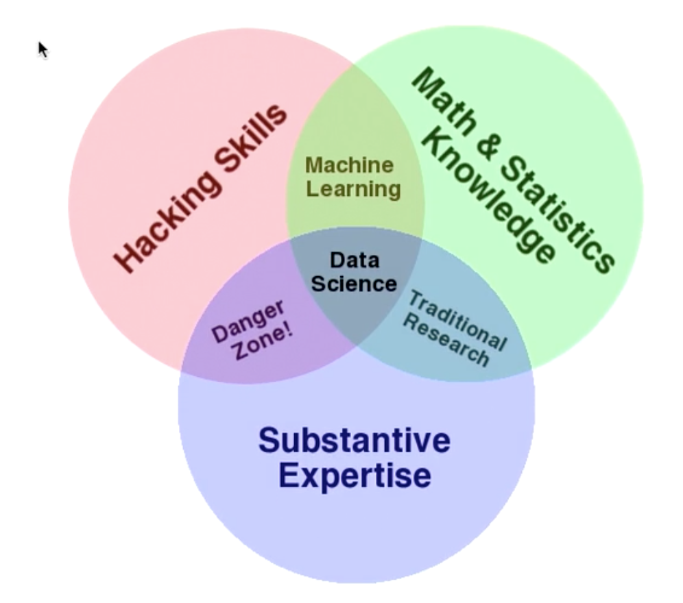
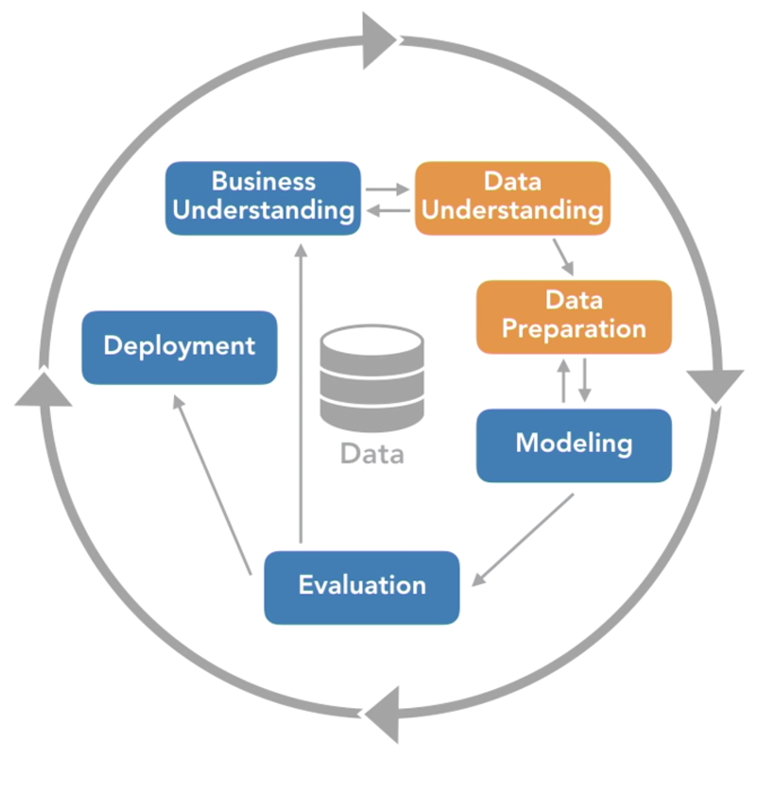

# Data Mining and Predictive Analysis

## **What is Data Mining and Predictive Analytics**

* Find previously unknown relationships to produce positive and verifiable outcomes through predictive models which can be deployed to new data.
* The data is not new
* The data being used was collected for a business usecase
* Proof
* Useful
* Must work on new data
* At the very basic, a predictive model is a bunch of rule-sets

* ### Problem Definition

  * Determine the business objective and translate into a decision to be made
    * Making a specific decision
    * Meeting a particular need
    * Creating a measurable goal.
    * It should be deployed
    * Same recurring decision
    * Two possible outcomes
  * Identify an intervention strategy:
    * Individual level
    * Time sensitive
    * Plan of action
  * Estimate the return on investment
    * There should be something to gains
    * Tangible benefit
    * Measurable: money earned, money saved or time saved.
    * Estimate the potential benefit
  * Program management
    * In general 1 project is not enough to have a final solution.
    * A coordinated set of projects (program) is required.

* ### **Data Requirements**

  * **Customer footprint**
    * Using the past to predict the future
    * Ongoing process, we use the data from the past and try to find patterns in current data to draw conclusions.
    * Known outcome
    * Customer footprint
  * **Flat File**
    * Rows and columns
    * Specific form
    * Custom built
  * **Understand your target**
    * Binary classification
    * Known outcome
    * **Labeled** historical data
  * **Select the data for modeling**
    * What is the purpose?
    * What is the deployment plan?
  * **Understand integration**
    * Lots of sources
    * Both internal and external (weather or unstructured data)
    * The tougher, the better
  * **Understand data construction**
    * Just one aspect but very very important
    * Most of your variables come from here.
    * They will mostly be the most important variables
      * Ratios and formulas (BMI or hip to waist ratio)
      * Date arithmetic (how long has someone been a customer on the day of coupon receipt)
      * Extraction (years are denoted as letters in the VIN number)

* ### **Resources Required**

  * **Understand the data mining algorithms**
    * The size of the dataset is hardly ever an issue
    * Brute force
    * Highly iterative
    * Scoring needs to be quick, but finding patterns takes time

  * **Assess Team Requirements**
    * Data Science is a team sport
    
  * **Budget Time**
    * It takes weeks or months not days.
    * Collaboration is difficult to rush.
    * Data mining data is custom built.
    * Have to reconvene once something has been built
    * Finally, the final model has to be deployed
  * **Work with subject matter experts**
    * The context for the business usecase comes from humans not from software.
    * Ask the SMEs if you're leaving something out!
    * Don't take any variables out yet. SMEs will also help you out with the interpretation of problems and problems with data quality.

* ### **Problems Faced**

  * **Deal with missing data**
    * You will always have some missing data.
    * Null or zero?
    * Some modeling techniques simply drop the whole row.
    * Missing data is not only a modeling problem but also a deployment problem. They have been cases of empty datasets, default locations etc just because the rows related to missing data were either ignored completely or weren't managed properly.
    * Handling missing data requires the involvement of SMEs, IT, modelers and the deployment team.

  * **Resolve organizational resistance**
    * Organizational change
    * Errors in historical data
    * Suggestions
      * Trial rollout
      * Involve the whole team
      * Anticipate concerns
  * **Why models degrade**
    * If the model is static and the world is changing, the model **IS** going to degrade.
    * Always keep monitoring the model's performance.
    * Recalibrate on need basis.
    * A remodel will eventually be required, add new variables and rework on the models.
    * Rebuild: business changes, new competitors, new lines of business etc.

## **Finding the solution**

* **Search the solution space**
  * Nothing to prove: if you're verifying an outcome having chosen the variables an predictors right, you're not doing data mining.
    * It is not testing hypotheses.
    * Data mining is data driven and exploratory
    * Validation is not the same as hypothesis testing.
  * Not the scientific method, scientific method works like this:
    * Start with a hypothesis
    * Get experimental data
    * Reject or accept (or refine) your hypothesis.
    * But in Data mining, the data is already there and you don't want to limit the search.
    * predictable mistakes:
      * Worry about statistical assumptions and rules, even when they don't apply
      * Limit their search
* **Unexpected results**
  * Never be frugal with variables just because everyone or SMEs say so.
  * The best advice is:
    * Leave variables in
    * Look for interactions
    * Know Surprises are good
* **Trial and error**
  * Trial and error is needed because of the usual data mining life cycle:
  * 
* **Construct proof**
  * There's no priori hypothesis but we do need proof.
  * The test dataset shouldn't be the same as the training data

## **Putting the solution to work**

* ### Understand propensity

  * Prediction scores come in the form of scores
  * When there are only 2 possibilities, it's called a propensity score.
  * A sample usecase looks like this, if
    * The customer pays on time
    * Within 3 months of contract ending
    * Has phone type x, y or z
    * Frequently updates the phone
    * Churn score > 60%
  * Then offer him a new phone 3 months early at 10% discount.
  * Yes, it was reached using another model.

* ### Understand meta-modelling

  * Ensembles
  * Models in series
    * For ex. we use a scoring model to decide which students might not be able to finish college.
    * Then use another model to decide the intervention strategy.
      * Some might need tutoring, some others might just need financial assistance.
  * Models in parallel
    * A usecase for this might be: one model to apply on complete data and another one to score the missing data usecases.

* ### Understand reproducibility

  * Data access
  * Integrating data
  * Preparing data
  * Scoring

* ### Master documentation

  * Reports after every phase
  * Deployment report
  * Variables: which were used and which weren't
  * Data sources
  * End user training

## **CRISP-DP and the nine laws**

* ### Understanding laws 1 and 2

  * Law 1: Business objectives are the origin of ever data mining solution
  * Law 1: Business objectives is central to every step of the data mining process

* ### Understanding law 3

  * Law 3: Data preparation is more than half of every data mining process

* ### Understanding laws 4 and 5

  * Law 4: The right model for a given application can only be discovered by experiment or **There is no Free Lunch for the Data Minor.**
  * Law 5: **Watkins' Law** There are always patterns.

* ### Understanding laws 6,7 and 8

  * Law 6: **Insight Law** Data mining amplifies perception in the business domain.
  * Law 7: **Prediction Law** Prediction increases information locally by generalization.
  * Law 8: **Value Law** The value of data mining results in not determined by the accuracy or stability of predictive models.

* ### Understanding law 9

  * Law 9: **Law of Change** All patterns are subject to change.